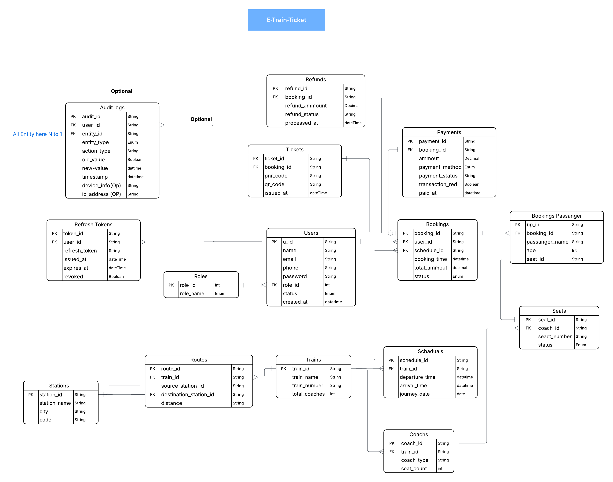

# E-train-tickets 

## System Architecture

#  Railway E-Ticket Platform — Requirements Analysis

##  System Overview
The Railway E-Ticket Platform is a web/mobile-based ticketing system designed to digitalize railway reservations.
It enables passengers to search trains in real time, check seat availability, book tickets, make secure payments,
download digital tickets (E-Ticket / QR Ticket), and manage bookings or cancellations.
This system replaces traditional ticket counters with a scalable, secure, and automated booking infrastructure.

##  Objectives
- Provide 24/7 online ticket booking access.
- Reduce dependency on physical ticket queues.
- Ensure secure identity-based reservations.
- Prevent fraud and duplicate bookings.
- Enable real-time seat inventory management.
- Provide transparent cancellation and refund processing.

##  User Roles (Authorization Model)

### 3.1 Passenger (Customer)
**Can:**
- Register and login securely.
- Search trains and check availability.
- Book and cancel tickets.
- Make payments.
- View booking history.
- Download digital tickets.

**Cannot:**
- Modify train schedules.
- Access administrative dashboards.

### 3.2 Admin (Railway Authority)
**Can:**
- Add/Edit train schedules.
- Manage routes and stations.
- Control seat inventory.
- View transactions and handle refunds.
- Generate operational reports.

### 3.3 Super Admin (System Controller)
**Can:**
- Manage admin accounts.
- Configure system-wide rules.
- Monitor audit and security logs.
- Override bookings when required.

##  Authentication Requirements
The platform must implement secure identity verification.

**Functional Requirements:**
- User registration with Name, Phone/Email (unique), optional National ID/Passport.
- Password must be securely hashed.
- Login via Email/Phone + Password.
- OTP verification for sensitive operations.
- Password reset via secure link or OTP.
- Session management using JWT / Secure Session ID.

**Security Rules:**
- Encrypted password storage (bcrypt/argon2).
- CAPTCHA to prevent automated abuse.
- Auto logout after inactivity.
- Multi-device login detection.

##  Role-Based Authorization (RBAC)

| Feature            | Passenger | Admin | Super Admin |
|--------------------|-----------|-------|-------------|
| Search Train       | ✅        | ✅    | ✅          |
| Book Ticket        | ✅        | ❌    | ❌          |
| Manage Train       | ❌        | ✅    | ✅          |
| View Reports       | ❌        | ✅    | ✅          |
| System Settings    | ❌        | ❌    | ✅          |

Authorization middleware must validate roles before each protected request
and prevent privilege escalation through direct URL access.

##  Core Functional Requirements

### Train Search Module
- Users select source, destination, and travel date.
- View available trains with filters (time, class, price).
- Results must reflect real-time availability.

### Seat Availability Engine
- Track seats per coach dynamically.
- Prevent double booking using transactional locking.
- Temporarily hold selected seats during payment (5–10 minutes).

### Ticket Booking Workflow
1️⃣ Select Train → 2️⃣ Choose Seat/Class → 3️⃣ Enter Passenger Details  
4️⃣ Fare Calculation → 5️⃣ Payment → 6️⃣ Ticket Generation → 7️⃣ Seat Update

### Digital Ticket Generation
- Unique PNR Number.
- QR Code verification.
- Passenger + journey details.
- Downloadable PDF ticket and in-app view.

### Payment Integration
- Supports cards, mobile banking, and online gateways.
- Handles payment callbacks securely.
- Prevents duplicate payment processing.
- Stores transaction logs safely.

### Cancellation & Refund Module
- Allows cancellation before departure.
- Refund calculated based on time rules.
- Automated refund initiation.
- Admin override supported.

### Booking History Dashboard
- View previous trips.
- Re-download tickets.
- Track refund status.

##  Data Requirements (Core Entities)
Users, Roles, Trains, Routes, Stations, Schedules,
Coaches, Seats, Bookings, Payments, Tickets, Refunds, Audit Logs.
All transactions must remain fully traceable.

##  Non-Functional Requirements

**Performance:** Must support high concurrent bookings with seat-lock latency under 200ms.  
**Scalability:** Designed for nationwide peak demand (holidays, festivals).  
**Reliability:** Strong database constraints to prevent duplicate reservations.  
**Availability:** Target uptime of 99.9%.  
**Security:** HTTPS enforcement, SQL injection protection, strict validation.  
**Compliance:** Protect and encrypt personal user data.

##  Reporting & Analytics (Admin Dashboard)
- Daily ticket sales summary.
- Route popularity analysis.
- Revenue and refund insights.
- Usage and operational metrics.

##  Recommended Integrations
- SMS/Email notification service.
- Government ID verification APIs.
- Payment gateway integrations.
- QR validation scanners for conductors.

##  Validation Rules
- Past-date journeys cannot be booked.
- Same passenger cannot reserve multiple seats in one booking (configurable).
- Failed payments must auto-release held seats.
- System must never allow overbooking.

##  Future Enhancements (Scalable Vision)
- Waitlist auto-confirmation engine.
- Dynamic pricing based on demand.
- Loyalty and rewards programs.
- Dedicated mobile application.
- AI-driven demand forecasting.

