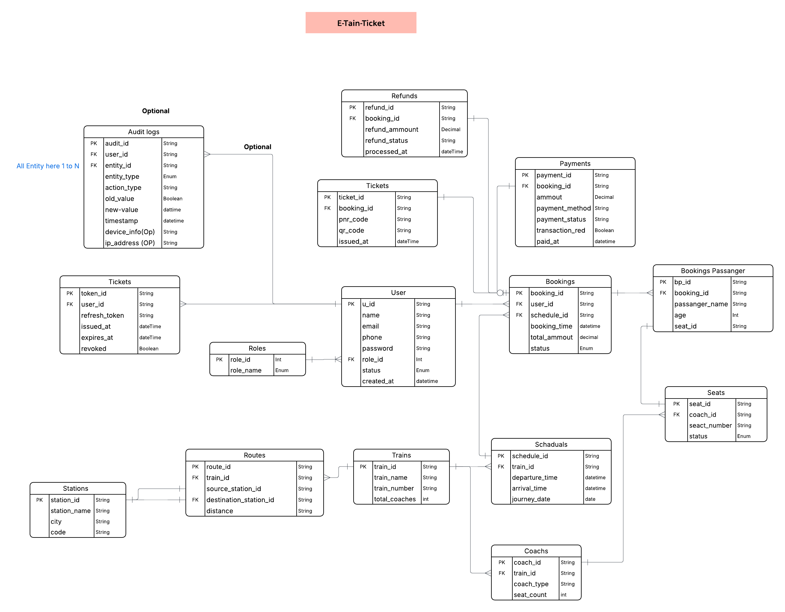

# E-train-tickets 


## System Architecture




#  Railway E-Ticket Platform — Requirements Analysis

##  System Overview
The Railway E-Ticket Platform is a web/mobile-based ticketing system designed to digitalize railway reservations.
It enables passengers to search trains in real time, check seat availability, book tickets, make secure payments,
download digital tickets (E-Ticket / QR Ticket), and manage bookings or cancellations.
This system replaces traditional ticket counters with a scalable, secure, and automated booking infrastructure.

##  Objectives
- Provide 24/7 online ticket booking access.
- Reduce dependency on physical ticket queues.
- Ensure secure identity-based reservations.
- Prevent fraud and duplicate bookings.
- Enable real-time seat inventory management.
- Provide transparent cancellation and refund processing.

##  User Roles (Authorization Model)

### 3.1 Passenger (Customer)
**Can:**
- Register and login securely.
- Search trains and check availability.
- Book and cancel tickets.
- Make payments.
- View booking history.
- Download digital tickets.

**Cannot:**
- Modify train schedules.
- Access administrative dashboards.

### 3.2 Admin (Railway Authority)
**Can:**
- Add/Edit train schedules.
- Manage routes and stations.
- Control seat inventory.
- View transactions and handle refunds.
- Generate operational reports.

### 3.3 Super Admin (System Controller)
**Can:**
- Manage admin accounts.
- Configure system-wide rules.
- Monitor audit and security logs.
- Override bookings when required.

##  Authentication Requirements
The platform must implement secure identity verification.

**Functional Requirements:**
- User registration with Name, Phone/Email (unique), optional National ID/Passport.
- Password must be securely hashed.
- Login via Email/Phone + Password.
- OTP verification for sensitive operations.
- Password reset via secure link or OTP.
- Session management using JWT / Secure Session ID.

**Security Rules:**
- Encrypted password storage (bcrypt/argon2).
- CAPTCHA to prevent automated abuse.
- Auto logout after inactivity.
- Multi-device login detection.

##  Role-Based Authorization (RBAC)

| Feature            | Passenger | Admin | Super Admin |
|--------------------|-----------|-------|-------------|
| Search Train       | ✅        | ✅    | ✅          |
| Book Ticket        | ✅        | ❌    | ❌          |
| Manage Train       | ❌        | ✅    | ✅          |
| View Reports       | ❌        | ✅    | ✅          |
| System Settings    | ❌        | ❌    | ✅          |

Authorization middleware must validate roles before each protected request
and prevent privilege escalation through direct URL access.

##  Core Functional Requirements

### Train Search Module
- Users select source, destination, and travel date.
- View available trains with filters (time, class, price).
- Results must reflect real-time availability.

### Seat Availability Engine
- Track seats per coach dynamically.
- Prevent double booking using transactional locking.
- Temporarily hold selected seats during payment (5–10 minutes).

### Ticket Booking Workflow
1️⃣ Select Train → 2️⃣ Choose Seat/Class → 3️⃣ Enter Passenger Details  
4️⃣ Fare Calculation → 5️⃣ Payment → 6️⃣ Ticket Generation → 7️⃣ Seat Update

### Digital Ticket Generation
- Unique PNR Number.
- QR Code verification.
- Passenger + journey details.
- Downloadable PDF ticket and in-app view.

### Payment Integration
- Supports cards, mobile banking, and online gateways.
- Handles payment callbacks securely.
- Prevents duplicate payment processing.
- Stores transaction logs safely.

### Cancellation & Refund Module
- Allows cancellation before departure.
- Refund calculated based on time rules.
- Automated refund initiation.
- Admin override supported.

### Booking History Dashboard
- View previous trips.
- Re-download tickets.
- Track refund status.

##  Data Requirements (Core Entities)
Users, Roles, Trains, Routes, Stations, Schedules,
Coaches, Seats, Bookings, Payments, Tickets, Refunds, Audit Logs.
All transactions must remain fully traceable.

##  Non-Functional Requirements

**Performance:** Must support high concurrent bookings with seat-lock latency under 200ms.  
**Scalability:** Designed for nationwide peak demand (holidays, festivals).  
**Reliability:** Strong database constraints to prevent duplicate reservations.  
**Availability:** Target uptime of 99.9%.  
**Security:** HTTPS enforcement, SQL injection protection, strict validation.  
**Compliance:** Protect and encrypt personal user data.

##  Reporting & Analytics (Admin Dashboard)
- Daily ticket sales summary.
- Route popularity analysis.
- Revenue and refund insights.
- Usage and operational metrics.

##  Recommended Integrations
- SMS/Email notification service.
- Government ID verification APIs.
- Payment gateway integrations.
- QR validation scanners for conductors.

##  Validation Rules
- Past-date journeys cannot be booked.
- Same passenger cannot reserve multiple seats in one booking (configurable).
- Failed payments must auto-release held seats.
- System must never allow overbooking.

##  Future Enhancements (Scalable Vision)
- Waitlist auto-confirmation engine.
- Dynamic pricing based on demand.
- Loyalty and rewards programs.
- Dedicated mobile application.
- AI-driven demand forecasting.


## Backend API Documentation 

This section documents all backend modules, endpoints, request/response structure, and role-based access.
APIs are grouped by functional modules, following production-level modular architecture.


## 1️⃣ Authentication Module (with Refresh Token)
Handles registration, login, OTP verification, password reset, and token refresh.

**POST /auth/register**
- Register a new Passenger.
- Body: `{ "name": string, "email": string, "phone": string, "password": string, "national_id": string (optional) }`
- Roles: Public
- Response: `201 Created` + user info (excluding password)

**POST /auth/login**
- Authenticate user and issue **JWT access token** and **refresh token**.
- Body: `{ "email_or_phone": string, "password": string }`
- Roles: Public
- Response: `200 OK`  
  ```json
  { "accessToken": "<JWT_ACCESS_TOKEN>", "refreshToken": "<JWT_REFRESH_TOKEN>" }
  ```

**POST /auth/refresh-token**
- Refresh expired access token using refresh token.
- Body: `{ "refreshToken": string }`
- Roles: Public (requires valid refresh token)
- Response: `200 OK`  
  ```json
  { "accessToken": "<NEW_JWT_ACCESS_TOKEN>", "refreshToken": "<NEW_REFRESH_TOKEN>" }
  ```

**POST /auth/logout**
- Invalidate refresh token (logout).
- Body: `{ "refreshToken": string }`
- Roles: Authenticated User
- Response: `200 OK` + confirmation

**POST /auth/otp-verify**
- Verify OTP for login or password reset.
- Body: `{ "user_id": UUID, "otp": string }`
- Roles: Public
- Response: `200 OK`

**POST /auth/password-reset**
- Reset password using OTP.
- Body: `{ "user_id": UUID, "new_password": string, "otp": string }`
- Roles: Public
- Response: `200 OK`


## 2️⃣ User Management Module
Manages users, profile updates, and admin-level user control.

**GET /users/:id**
- Fetch user profile.
- Roles: Admin, SuperAdmin
- Response: `200 OK` + user details

**PATCH /users/:id**
- Update user information or role/status.
- Roles: Admin, SuperAdmin
- Response: `200 OK` + updated user

**DELETE /users/:id**
- Deactivate or remove user.
- Roles: SuperAdmin
- Response: `204 No Content`

## 3️⃣ Train & Route Management Module
Handles all train, route, and schedule operations.

**GET /trains**
- List all trains with optional filters (source, destination, date)
- Roles: Passenger, Admin, SuperAdmin
- Response: `200 OK` + array of trains

**POST /trains**
- Add new train.
- Roles: Admin, SuperAdmin
- Response: `201 Created`

**PATCH /trains/:id**
- Update train info.
- Roles: Admin, SuperAdmin
- Response: `200 OK`

**DELETE /trains/:id**
- Remove train from system.
- Roles: SuperAdmin
- Response: `204 No Content`

**GET /routes**
- List all routes or filter by train.
- Roles: Passenger, Admin, SuperAdmin
- Response: `200 OK`

**POST /routes**
- Add new route.
- Roles: Admin, SuperAdmin
- Response: `201 Created`

**GET /schedules**
- Fetch schedules by train or date.
- Roles: Passenger, Admin, SuperAdmin
- Response: `200 OK`

**POST /schedules**
- Create new schedule entry.
- Roles: Admin, SuperAdmin
- Response: `201 Created`

## 4️⃣ Coach & Seat Management Module
Manages coaches, seat allocation, and availability.

**GET /coaches/:train_id**
- List all coaches for a train.
- Roles: Passenger, Admin, SuperAdmin
- Response: `200 OK`

**GET /seats/:coach_id**
- List all seats and status for a coach.
- Roles: Passenger, Admin, SuperAdmin
- Response: `200 OK` + seat status

## 5️⃣ Booking Module
Handles ticket creation, modification, and cancellation.

**POST /bookings**
- Create new booking.
- Body: `{ "user_id": UUID, "schedule_id": int, "passengers": [{ "name": string, "age": int, "seat_id": int }] }`
- Roles: Passenger
- Response: `201 Created` + booking info

**GET /bookings/:id**
- Get booking details by booking ID.
- Roles: Passenger (own), Admin, SuperAdmin
- Response: `200 OK`

**PATCH /bookings/:id/cancel**
- Cancel booking before departure.
- Roles: Passenger (own), Admin
- Response: `200 OK` + refund details

## 6️⃣ Payment Module
Handles all payment processing and transaction logging.

**POST /payments**
- Process payment for a booking.
- Body: `{ "booking_id": UUID, "amount": decimal, "payment_method": string }`
- Roles: Passenger
- Response: `200 OK` + payment status

**GET /payments/:id/status**
- Check payment status.
- Roles: Passenger, Admin, SuperAdmin
- Response: `200 OK`

## 7️⃣ Ticket Module
Generates and manages digital tickets.

**GET /tickets/:pnr**
- Retrieve ticket by PNR code.
- Roles: Passenger (own), Admin, SuperAdmin
- Response: `200 OK` + ticket info with QR code

**GET /tickets/:pnr/pdf**
- Download PDF version of ticket.
- Roles: Passenger (own), Admin, SuperAdmin
- Response: `200 OK` + PDF stream

## 8️⃣ Refund Module
Handles refunds and administrative overrides.

**GET /refunds/:booking_id**
- Check refund status.
- Roles: Passenger (own), Admin
- Response: `200 OK`

**POST /refunds/:booking_id/process**
- Admin processes or overrides refund.
- Roles: Admin, SuperAdmin
- Response: `200 OK` + refund processed

## Notes for Developers
- All endpoints validate input using DTOs or schemas.
- JWT authentication required for protected routes.
- Seat locking during payment prevents double booking.
- Audit logs maintained for all sensitive admin actions.
- High concurrency handled via transactions and Redis-based locks.


